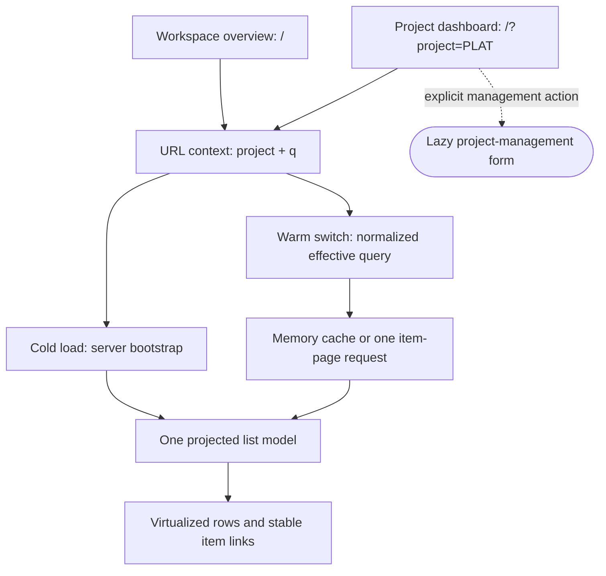
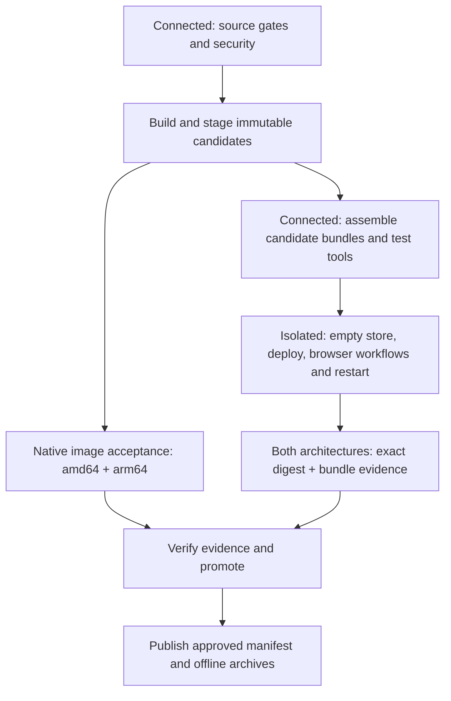

# Sierx Phase 2: code design and implementation plan

Prepared October 9, 2026. Plan baseline: merge commit `a10425611a4492cc2469366231049b76a0838cec`. Implementation status is tracked below and in the current branch; this document does not claim Phase 2 acceptance.

Revised October 9 to incorporate the legal/security audit and owner direction: the current US-operated testbed is private to the owner; self-hosted deployments may later enable public signup; children need an explicit admission/handling design; notification email is optional future work; no paid subscriptions are planned. See the companion legal/security audit for baseline file/line evidence and legal-source references.

## Implementation status (October 2026)

The implementation branch covers the security/privacy workstream F1–F7. F1 role separation/RLS, F2 local legal-document surfaces and truthful operator-configured privacy content, F3 fail-closed signup modes, F4 offline asset/secret/request controls, F5 scope boundaries, F6 title/accessibility automation, and F7 machine-checkable release gates have code or documentation evidence. F2's data-lifecycle handling remains incomplete: reversible account suspension and a bounded operator-mediated export are implemented, but broader authenticated access/export, correction of historical copies, content redaction, holds, membership removal, and erasure-aware restore are not. The export is limited to profile, memberships, authored comments, and owned saved views and is not a complete personal-data export. A restricted operator intake procedure is documented but is not a substitute for these workflows.

F5 adds no email delivery or billing implementation; public signup, invitation and child admission remain disabled. F6's manual screen-reader and whole-workflow review has not been performed, so automated accessibility evidence is not a WCAG conformance claim. Operator-specific privacy facts, deployment role transition/recovery, host acceptance, and Phase 2 real-use/signoff requirements remain open. F7 is the implementation boundary, not a declaration that Phase 2 has exited.

## Objective and known state

Finish a usable, fast backlog with multiple peer projects in one workspace; prove that a prepared release can deploy and operate without public network access; establish the remaining operator and real-use evidence for Phase 2 exit.

The owner selected native **amd64 and arm64** offline-delivery coverage. The active testbed is **the owner-operated testbed**, running Rocky Linux 10 on operator-provided hardware. Confirm the exact model, CPU/architecture, RAM, storage, Podman/systemd versions and SELinux state rather than treating the model recollection as a measurement. Daily use is starting; record qualifying days as actual primary-backlog work occurs.

Known implementation and evidence:

- PR #16 is merged. Its automated architecture/browser gates and hosted security checks passed. These results do not establish deployment, recovery or complete phase exit.
- Project list/detail/create APIs already exist. Project creation is administrator-only and transactionally installs default workflow configuration. There is no project metadata PATCH API or organizational owner field.
- The list renders projected, virtualized items and accepts `sxq` queries. Item creation already offers a project selector and loads that project's configuration.
- The release workflow already builds and tests both native architectures. Its offline jobs import a bundle into an empty image store inside a loopback-only network namespace, exercise HTTPS/API operations and restart persistence, then publish an archive.
- That offline test starts containers directly as root. It does not prove the normal rootless service installer, full browser behavior, two-release updates, or absence of attempted external connections.
- Offline bundle acceptance now runs against each exact tested architecture digest before the multi-architecture release manifest is promoted. Promotion verifies both matching native reports and the archive/lock digests.
- The offline host runbook currently names Ubuntu 24.04. Rocky 10 host acceptance needs explicit coverage and documentation.
- ADR-020 removes the Phase 2 calendar deadline and immediate Pi requirement. No small-hardware performance claim follows from faster testbed results.

## Design boundaries

Workspace membership governs access. Projects inherit its `member`/`admin` permissions. Project owners describe accountability, never authorization. Keep project creation and metadata management administrator-only, consistent with the existing create API. Members can select projects and create/edit items under existing workspace rules.

Items retain one owning project, stable UUIDs and permanent keys. Metadata edits never rewrite item keys, reset counters or replace workflow history. Project kinds remain descriptive; this work does not introduce project nesting, cross-project reassignment, per-project ACLs, boards, sprints or other Phase 3–7 implementations.

"Offline" means no external network is required after the prepared release and host prerequisites have been delivered. Browser-to-server traffic, the database and explicitly configured internal services are still necessary. Browser offline editing and synchronization are separate future capabilities.

The public testbed may intentionally use a tunnel, public DNS or certificate renewal. Public access to that deployment depends on those selected services. Prove the offline contract independently using direct HTTPS and provided certificates in an isolated environment; do not disconnect the active backlog to simulate isolation.

## Workstream A — Project metadata and management

### Database design

Add the next migration, provisionally `migrations/0010_project_metadata.sql`, after checking numbering at implementation time:

| Field/constraint | Design |
|---|---|
| `project.owner_id` | Nullable UUID; organizational owner |
| `project.version` | Positive integer, default 1; optimistic concurrency for metadata |
| `project.updated_at` | Timestamp with time zone; maintained on metadata changes |
| Owner membership | Composite FK `(workspace_id, owner_id)` → `membership(workspace_id, user_id)` |

The FK prevents assigning a member of another workspace. Validate active-account status in the transaction. Keep membership deletion restricted while referenced: a future member-removal operation must explicitly clear/reassign organizational ownership in that same transaction. Do not introduce a cascading deletion of a project or its workspace. Existing projects migrate with no owner and version 1.

Use the existing store/API organization. Update bootstrap/project scan sites, fixture snapshots, goldens and backup/restore checks that enumerate schema columns. Do not edit historical migrations.

### API contract

Extend project representations with `owner` (null or minimal ID/display name), `version` and `updated_at`. Align `web/src/api/client.ts` with the full existing project contract, including `id` and `kind`, rather than maintaining a second incomplete shape.

| Operation | Proposed behavior |
|---|---|
| `POST /api/v1/projects` | Existing prefix/name/kind inputs plus optional `owner_id`; default configuration created atomically |
| `GET /api/v1/projects` | Existing signed pagination, optional archived inclusion; owner/version metadata included |
| `GET /api/v1/projects/{key}` | Workspace-scoped metadata and an ETag representing metadata version |
| `PATCH /api/v1/projects/{key}` | Admin-only update of `name` and `owner_id`; requires `If-Match` |
| `GET /api/v1/members` | New bounded, workspace-scoped selector endpoint for active ID/display-name records; no email/authentication fields; admin-only in this scope |

Metadata PATCH preserves the existing prefix and kind. Prefix renaming and kind conversion need separate policies and are outside this closeout. Reject unknown or immutable fields rather than silently ignoring them. Omitted fields remain unchanged; explicit `owner_id: null` clears ownership. Reject an empty PATCH. Retain the existing 1–200-character name and reserved-prefix rules.

Follow the existing mutation conventions: missing `If-Match` returns 428, malformed versions return a client error, stale versions return 409 with current/submitted project metadata. Compare-and-update inside a transaction; no silent last-write-wins. Use a project-specific conflict payload/type so project conflicts cannot enter the existing item cache as an `Item`.

Project metadata does not currently participate in the item change stream. For this phase, explicitly invalidate project queries after local writes and refresh stale project metadata when navigation/management is used. Do not emit fake item events. Workflow configuration stays versioned separately from project metadata.

### Management UI

Add an admin-visible **Create project** control beside project navigation and an **Edit project** action for the selected project. Use existing dialog, button, form and conflict/draft patterns. Load the form code and member selector only when management is opened.

Create fields: name, key prefix, kind, optional organizational owner. Edit fields: name and owner; show immutable prefix/kind as descriptive values. Explain owner as accountability metadata in ordinary product language. On successful creation, select the new project and offer item creation. On failed creation/edit or expired session, preserve all input and restore focus appropriately.

No-project state gives administrators a direct create action; members see a useful request-to-admin message. One-project installations retain the simple interface, with management still reachable. Archived projects remain inspectable through the existing inclusion behavior, but are excluded from new-item selection; adding archive/unarchive controls is not required here.

Relevant files: `internal/api/projects.go`, `internal/api/projects_test.go`, `internal/api/auth.go`, `internal/api/authorization_test.go`, the new migration, `web/src/api/client.ts`, and proposed `web/src/components/ProjectManagement.tsx` / `ProjectNavigation.tsx`.

## Workstream B — Project dashboards and fast navigation

### One list model, two useful contexts

Keep `/` as the workspace overview. Add an explicit project context to the existing list rather than a separate dashboard engine. A dashboard in this phase means the projected list, project heading and filters; charts, board layouts and aggregation widgets are not required.

Proposed URLs:

```text
/                               workspace overview
/?project=PLAT                  PLAT dashboard
/?project=PLAT&q=status%20%3D%20active
/?q=project%20%3D%20PLAT         existing query-only link remains valid
/PLAT-42                        permanent item detail link
```

The new `project` parameter is an explicit query scope, not an access boundary. Extend the URL/bootstrap contract and document this small ADR-018-compatible addition. The server validates the selected project in the authenticated workspace and combines it with `q` using the query parser/compiler: parenthesize predicates, preserve ordering, and never splice unchecked text or SQL. `project` plus a contradictory query correctly produces an empty result.

Use the same normalized effective query for server bootstrap, API requests, pagination cursor scope and client cache keys. Store the selected project in the URL. Saved views retain an equivalent complete effective `sxq` query, so project meaning is not lost if a view is reopened without the `project` parameter. Continue supporting existing saved-view APIs; a complete new saved-view editor is optional follow-up work.

### Loading behavior

Cold/deep-link load: `bootstrapList` supplies selected-project metadata, the first projected item page and a bounded project page in the original HTML. The first useful list must not wait for a project-list request followed by an item request. Handle a selected project beyond the first project page with a workspace-scoped lookup during bootstrap.

Warm navigation: refactor `List.tsx` so changing a URL query can change its active query without remounting the whole application. Use a small history/popstate helper or the existing routing mechanism after inspection; do not add a routing framework solely for this feature. Preserve native anchors for progressive fallback, new tabs and copied links.

TanStack Query remains the item cache. Use bootstrap `initialData` only when it matches the active normalized query; never seed a new project's cache with the previous project's items. Cached results switch immediately. Uncached selections request one projected page, announce loading and do not label old results as belonging to the newly selected project. Cancel obsolete requests and protect against responses completing out of order.

Project navigation uses a bounded, searchable selector with paginated loading; it does not fetch every project, workflow or dashboard on startup. Keep the existing first-page item limit and virtualization. Do not prefetch every project. If cached list contexts accumulate during many switches, bound cache retention; keep the active view and a small number of recent contexts rather than all 10k-item pages indefinitely.

Item creation defaults to the selected project; the workspace overview defaults to the sole active project, or requires an explicit choice when multiple projects exist. Changing the project reloads applicable type/initial-status choices, clears invalid selections, preserves independent title/body text, and prevents submission while configuration is unresolved. No hardcoded status fallback. Offer a normal cross-project item link without a project switch requirement.



Relevant files: `internal/api/documents.go`, query/bootstrap tests, `web/src/routes/List.tsx`, `web/src/components/Create.tsx`, `web/src/components/Shell.tsx`, `web/src/api/client.ts`, and proposed `web/src/api/projects.ts` / `web/src/navigation.ts`.

## Workstream C — GitHub proof of offline delivery

### Required workflow ordering

Refactor the release graph so offline acceptance gates promotion instead of following it. Build a candidate manifest from the staged immutable per-architecture image digests and exact revision; it is test input, not a published approved release. Extend the verifier/controller to distinguish candidate test evidence from final promoted approval while retaining identical image/revision checks.



Separate delivery content from test tooling. Browser binaries, connection observers and host test tools are acquired before isolation and are not dependencies of the production deployment. Action/artifact download/upload and GitHub reporting remain outside the isolated workload. No CI registry token, cloud credential or live testbed data enters the isolated fixture.

Keep a reproducer in scripts/Make targets. Proposed targets are `offline-candidate-prepare`, `gate-offline-delivery`, `prove-offline-delivery` and `gate-offline-host`; they are planned names, not existing commands. Reuse `release-offline-bundle`, `release-offline-test` and their existing implementation where practical. Do not duplicate bundle verification/import logic in workflow YAML.

### Two test layers

1. **Native delivery/runtime gate on every relevant PR and before promotion, amd64 and arm64.** Extend the existing loopback-only namespace and fresh Podman store fixture. PR tests use locally built candidate images and SBOMs, without publishing packages or requiring secrets; adapt bundle assembly to verified local candidates. Release tests consume the exact staged digests. The same test checks supplied TLS, bundled operator tools, migrations and browser behavior against that artifact.
2. **Rootless service-installer gate before promotion.** Run the actual `offline.py` import/db-up/migrate/bootstrap/plan/apply path with an isolated home, database, image store and disposable user service manager. The service manager and every child service must remain inside the test's isolation boundary; a call to the runner's ordinary user bus is invalid. First implement a small feasibility check for a dedicated unprivileged account/private bus inside the namespace. If the runner cannot support that correctly, use a prepared disposable booted guest and prove its isolation; do not mock `systemctl` and claim host acceptance. Cover the documented Linux host profile on both native runners. Add Rocky 10 amd64 host-profile coverage for the actual testbed, subject to confirming its architecture.

Use the first layer to provide fast PR feedback. Run broader host tests when deployment/runtime/bundle inputs change and on release; a stable required aggregate must account for conditional jobs explicitly. Missing prerequisites, skipped native coverage or incomplete evidence fail the applicable release gate. Confirm actual GitHub check names before updating required-check enforcement; green jobs alone do not prove branch protection.

### Isolation, external attempts and evidence

- Assert the workload namespace contains only loopback, no external route, and no usable external DNS path. Cover IPv4 and IPv6. Start before bundle verification/import, not after installation.
- Disable runtime image pulls; missing app/database/gateway images fail. Provide certificate/CA material locally; no ACME, OCSP download, remote fonts, CDN scripts, package installs, license lookups or update polling during isolated operations.
- Record browser requests at context level, including redirects, subresources, workers and websocket creation. Reject attempted origins outside the fixture's allowed same-origin HTTPS endpoint. Explicitly control service workers so they cannot conceal requests. Allow user-clicked external links only in a separate opt-in scenario, not the default workflow.
- Add server/installer observation as well as blocking. Prototype syscall connection/send tracing or equivalent process/cgroup observation on both architectures; include the app, gateway, database, deployment tools and test browsers from process start. Detect external destinations even when connection attempts fail. Account for TCP, UDP, DNS and IPv6; local Unix sockets and allowed local database/browser traffic are permitted.
- Connection observation must prove coverage with deliberately planted external requests from each tested process class, including a DNS request. If the tracer cannot observe a process from startup, evidence cannot claim zero attempts for that process. Keep the no-external-route test independently valid while closing observer gaps.
- Write sanitized, versioned JSON evidence bound to commit, native architecture, candidate image digest, bundle lock hash, test-suite version, isolation description, browser versions, required checks, observed external requests/attempts and result. Final promotion validates both complete reports. Failed or stale runs never leave passing evidence.
- Raw traces may contain request data. Use only synthetic fixtures, summarize destinations/counts, and publish no credentials, session cookies or private subprocess diagnostics.

### Required acceptance scenarios

| Scenario | Passing condition |
|---|---|
| Fresh delivery | Verified bundle imports into an empty image store; no Git, compiler, npm or network acquisition required |
| Real deployment | Migrations/bootstrap and actual rootless plan/apply succeed with supplied HTTPS trust |
| Browser startup | Clean browser profile/cold cache loads login, workspace, filtered project and permanent item URL from delivered assets |
| Core work | Login, create/edit project, create item, transition, comment, link, search and reload succeed with local-only traffic |
| Initial rendering | Workspace/project/item content appears without bootstrap API waterfall; canonical redirects work |
| Restart | Database/app/gateway restart preserves data, item fingerprint, configuration and authentication access |
| Repeated deployment | Applying the same accepted revision/configuration is a no-op and triggers no acquisition |
| Failed delivery | Missing image, altered archive/file, wrong architecture, wrong digest and missing certificate fail with no fallback downloads |
| Failed update | Candidate health failure restores prior service configuration; accepted revision does not advance |
| Two-release update | Two retained approved bundles exercise offline update and compatible rollback; explicitly test schema compatibility |
| Persistent runtime | Several change-feed intervals plus an accelerated timer-trigger scenario produce no unsolicited acquisition; enumerate enabled units/timers |
| Observer negative controls | Planted browser request, registry pull, installer fetch, DNS/UDP and IPv6 attempt each fail and are recorded |
| Opt-in connectivity | A separate synthetic connected scenario performs approved acquisition, then runtime still uses local assets; no live CI/CD service is contacted by the isolated case |

Use a fixed, bounded runtime soak in CI, initially 120 seconds, plus explicit timer/configuration tests. This bounds the claim to the exercised paths and observation interval; it is not proof of every future operating interval. Actual reboot and deployment longevity are recorded on the testbed separately.

Two-release testing needs a compatible previously accepted bundle. Do not silently substitute the same release twice. On the first run without that fixture, record the gap and block the closeout claim until a previous bundle is supplied; a deliberately broken same-revision fixture proves failure handling, not real upgrade compatibility.

Relevant files: `.github/workflows/release.yml`, `.github/workflows/ci.yml` or a reusable offline workflow, `scripts/offline-release.sh`, `scripts/offline.py`, `scripts/test-offline-bundle.py`, `scripts/release-evidence.py`, `scripts/deploy.py`, `test/python/test_offline.py`, `test/python/test_release_evidence.py`, and proposed isolated host/network/browser fixtures. Update evidence schemas and negative controls together.

## Workstream D — Speed measurements and regression protection

Retain existing hard ceilings: initial JS 250,000 bytes; initial CSS 20,000 bytes; each lazy JS chunk 60,000 bytes, all Brotli quality 11. Record the current exact-head build as the baseline before changes. Keep project forms/member lookup out of the startup graph; add no charting framework, remote assets, runtime CSS-in-JS or browser persistence of application state.

The list continues to use explicit projection and 100-item pages. Keep the existing 10k-item browser proof: fewer than 50 rendered list rows and fewer than 700 body elements with keyboard focus retained. Add multiple-project and many-project fixtures, including a selected project beyond the first project page. Test rapid switching and back/forward while requests complete out of order.

Proposed additional feature checks (new plan targets, not previously accepted phase metrics):

| Measurement | Target |
|---|---|
| Cold project dashboard | No extra serialized API request before first useful list render |
| Uncached project switch | One item-page request; no project→config→item request chain |
| Cached switch | Selection-to-visible cached results p95 ≤100 ms on the recorded fixture hardware; report instrumentation overhead |
| Scoped indexed item query | p95 <200 ms on the 10k fixture, using the existing indexed-query budget |
| Long switching session | Query-cache retention remains bounded by the documented active/recent context policy |
| External browser assets/requests | Zero attempted external requests in the default workflow |

A delayed-network browser scenario at 650 ms RTT verifies responsive controls/loading feedback and draft preservation; it must not claim that an uncached request completes faster than the imposed network delay. Use repeatable local browser timing for comparisons and diagnose regressions rather than enforcing a hardware-dependent UI threshold on an unstable hosted runner.

Repair the performance evidence gap: `scripts/bench.sh` retains its database/store smoke role, including the executable SXQ query. `make bench-http` now validates an active 10,000-item project, warms up authenticated read-only HTTP scenarios, takes at least 500 measured samples, and emits sample count/p50/p95/max, response bytes, and non-host-identifying fixture/hardware identity. Its percentile calculation has known-data tests. These timings include client/TLS/network overhead; use a direct local target when comparing them with server budgets. `make bench-process` separately collects repeated fresh process readiness and warmed RSS against the same 10k fixture. Real chosen-host results remain operator evidence and must not be inferred from HTTP timings or Go benchmark averages. Never label an average as p95 or silently skip a required scenario.

Keep SPEC §12's targets: board 150 ms, item detail 100 ms, indexed query 200 ms, depth-six rollup 50 ms, 50-change feed 80 ms and <20 KB, full-text search 300 ms, 200-item bulk rollup <2 s, RSS <80 MB, cold start <1 s. Reconcile the existing executable binary-byte conventions with the prose units explicitly. Mark phase-dependent scenarios with their actual implementation boundary; this work does not implement a Kanban view to obtain a Phase 2 result.

On the owner-operated testbed, distinguish public end-to-end latency (tunnel/TLS/network included) from local server processing. Collect operator-run synthetic or sanitized aggregate timings and correlate with structured request durations. Run a separate disposable 10k seed, never seed/reset the daily-use database. Label results **Rocky 10 / confirmed testbed hardware**; representative small-host acceptance remains separately chosen under ADR-020. No new analytics service is needed.

## Workstream E — Rocky testbed, recovery and seven-day acceptance

Start with a read-only operator inventory: exact deployed revision/digests, Rocky release, architecture, CPU/RAM/storage, Podman/systemd, cgroup mode, user lingering, enabled services/timers, gateway/certificate mode and SELinux enforcement. Record no private keys, credentials or database contents in the public evidence.

Document a Rocky 10 host profile only after its prerequisites and normal rootless operations have been demonstrated. Verify Quadlet generation, mount labels, file permissions, networking, user-service startup and SELinux denials with enforcing mode retained; do not solve a permission failure by disabling SELinux. Install/provision host tools while connected or from separately verified media. Keep that prerequisite boundary explicit.

Continue public access through the chosen testbed gateway. Test direct offline HTTPS in a separate fixture. Connectivity remains explicit: connected acquisition is an operator/CI action, and an automatic deployment timer is enabled only when requested. Offline mode rejects the connected pull timer. Maintenance and backups can use deliberately configured local/internal services; they are not an implicit permission to contact public endpoints.

Before applying the metadata migration to valuable data, complete encrypted off-machine backup/restore acceptance: populated data, counts/checksum/counters/rollups, preserved configuration, restored application login/deep link, original session-key requirements and wrong-key rejection. Recovery uses a separate scratch cluster/database and cannot overwrite the daily backlog. Rehearse both success and rollback with retained compatible releases.

Since daily use is beginning, record qualifying days now rather than waiting for every UI improvement. Preserve the real deployed revision and defects for each day. After adopting the new release, add targeted project/offline-feature acceptance; a code change does not automatically erase earlier genuine daily-use evidence. Record materially disruptive failures or tracker fallback and have the owner decide whether a fresh continuous period is needed. Do not fabricate retrospective dates.

The existing cutover script requires an empty active backlog. If the testbed already contains real work, do not run it blindly, bootstrap again or reset the database. Inspect the existing SRX project/items and record the equivalent acceptance, including a real item describing Phase 3 and the transfer of remaining development work into Sierx. Resolve any missing cutover prerequisite explicitly while preserving accumulated data.

Finish manual Brave/Firefox review: keyboard-only flows, multi-project selection, zoom/text spacing, all appearances, session-expired draft recovery, actual conflict differences, enrolled TOTP/recovery-code behavior, copy, elevation/state cues and 60/30/10 proportions. Record the owner's actual decisions, browser versions and remaining defect keys.

## Workstream F — Security, privacy and legal design controls

The companion `LEGAL-SECURITY-AUDIT.md` identifies confirmed code gaps, absence of currently offered features and conditional legal requirements. These are engineering controls and operator responsibilities, not a blanket claim that every self-hosted deployment has identical legal obligations.

### F1. Effective RLS and separate database privileges

Make the requested RLS control effective across all application-owned tables and generated event partitions. The baseline has no migration-declared policies, and the default provisioning uses the application's DATABASE_URL identity as POSTGRES_USER. Add separate runtime and privileged bootstrap/migration/maintenance credentials. Runtime must be NOSUPERUSER/NOBYPASSRLS, not own tables, and have no DDL/TRUNCATE privilege. Inventory an existing host's roles before changing it; verify recovery first and transition without resetting the database.

Add the next available migrations after project metadata, with ENABLE/FORCE RLS and command-specific USING/WITH CHECK where needed. Cover direct workspace rows, project/item-derived ownership, link endpoints, saved-view shared/owner visibility and comment author/admin writes. Global user/session authentication requires narrowly scoped functions or a separately constrained auth path; runtime roster access must not expose password hashes or encrypted MFA state. Fix security-definer search paths and revoke unnecessary PUBLIC/schema/function privileges. Goose metadata and partition creation need explicit protection/coverage; do not omit them from catalog checks.

Refactor the request database boundary so authenticated identity is resolved before transaction-local tenant/user context is set. A request-scoped executor supplies the same context to reads and store mutations; context must not leak through pooled sessions, rollback, cancellation, nesting or prepared statements. Do not put an unrestricted privileged pool on ordinary endpoint paths. Keep current API authorization and parameterized query rules as additional controls.

Add `gate-db-privileges` and `gate-rls` as proposed offline-capable targets: query the actual catalog for every application table/partition and policy, prove runtime role attributes, and exercise direct SQL read/insert/update/delete isolation without endpoint predicates. Include missing context, alternating concurrent tenants, global auth/login, same-workspace roles, shared/private saved views, linked items, backup completeness and newly created partitions. Index indirect ownership predicates; repeat the 10k latency/plan measurements after policies. This work is more substantial than merely adding ALTER TABLE statements.

### F2. Truthful local notices and lifecycle design

Add small public `/privacy`, `/copyright` and `/third-party` document surfaces served from locally delivered assets/templates, with footer links on login and inside the app. These are public documents and must not require account bootstrap/API calls or reveal workspace data. Reserve new root prefixes and update route generation/injection rules. Ensure both cached/deep-link and isolated deployment paths can render them; preserve first-route budgets.

Privacy content must describe current account/profile data, password/MFA/session handling, work content/history, preferences, structured actor/workspace logs, transient rate-limit IP handling, backups and the operator's actual proxy/provider configuration. Each independent instance supplies its operator identity, contact and retention/access practices. Serve escaped/versioned structured content or vetted local templates, not arbitrary scripts or untrusted raw HTML. Do not invent a contact/address or ship a policy with false retention promises. Include policy version/effective date and an operator-review checklist; a policy acknowledgment is not consent to optional tracking.

Add `docs/DATA-INVENTORY.md`, `docs/PRIVACY-OPERATIONS.md`, `docs/DATA-LIFECYCLE-DESIGN.md` and a legal-design register during implementation. Reconcile the current no-history-pruning requirement with purpose-limited retention and requests. Define authenticated access/export and correction, legal holds, event payload/search/comment copies, backup expiry and erasure restrictions after restore. Keep stable keys and necessary tombstones; do not describe soft delete as erasure. Use supported, tested operator tooling rather than asking operators to hand-edit database rows. Reversible global account suspension and session revocation are implemented under the maintenance role; membership replacement, holds, takedowns, bounded export/redaction/correction, explicit retention and replay-before-access are implemented under ADR-028. Instance authority and policy facts remain operator-controlled.

For a relevant hosted operator seeking copyright safe-harbor protection, `/copyright` provides the actual operator/agent information and notice/counter-notice procedure. Registration/renewal and legal determinations remain operator actions. Retain a repeat-infringer policy and controlled evidence process where applicable. Ordinary item soft deletion remains readable, so a takedown requires an access-disable state that also covers history, comments, links, search and bootstrap. Do not automatically equate an allegation with permanent deletion; preserve the applicable counter-notice/restoration path. The current private single-owner testbed does not establish a mandatory registration requirement for every installation.

### F3. Optional public signup and child handling, disabled by default

Scaffold the admission/configuration contract and tests during Phase 2; do not activate public account creation on the current testbed. A proposed registration mode distinguishes private/admin provisioning, invitations and public admission. Public mode must be explicit and fail closed if its prerequisite controls/notices are missing. This is owner-requested design groundwork, not an early implementation of later boards/sprints.

Before an applicable public admission flow, include neutral age screening before profile/contact collection, with no adult default/coaching and minimum retained admission data. Under-13 results stop ordinary signup and direct a parent/guardian to the instance operator. Supporting covered child accounts requires a reviewed verified-parent-consent and parent access/deletion flow; until complete, child admission stays disabled. Define an actual-knowledge response for existing accounts and a way to stop ordinary collection while a verified request is handled. Age screening is not a universal exemption for a child-directed service. Do not add mandatory birth-date collection to the current private bootstrap path.

Future signup also needs abuse/rate-limit/email-verification decisions, secure session/account lifecycle, and explicit workspace membership/default permissions. In the existing workspace model members can read/write all workspace items; public signup must not silently enroll every registrant in the operator's private backlog. Decide isolated tenant onboarding versus invitation to a shared workspace before enabling the route. Do not use project ownership as an access role. Review the existing authentication assumption of one resolved workspace per account before admitting multi-workspace users.

### F4. Tracking and external resource prevention

Preserve the current absence of analytics, replay and pixels. Fix `web/scripts/offline-assets.mjs`: it currently skips remote HTML src/href references, and three scratch negative controls (script, stylesheet, image) wrongly pass. Parse resource-bearing elements/attributes and distinguish clicked hyperlinks from automatically fetched scripts/styles/frames/fonts/images/preloads. Include built JavaScript behavior in runtime testing rather than relying on text matching alone. Tighten CSP img-src to needed local sources; retain same-origin scripts/connects, external-image-to-link Markdown and no body/credential logging.

Extend Workstream C's default browser/server request observation to authentication, project forms, comments, any future chat, payment or health content. No field capture or replay is allowed there even after optional analytics consent. Optional analytics would need a separate design with consent-before-load where applicable, withdrawal and explicit event/data allowlists; adding a consent SDK now is unnecessary. Necessary authentication cookies and local aggregate performance measurements require accurate disclosure and data minimization, not a blanket consent checkbox.

Add a prepared offline secret gate for source/diffs and built frontend artifacts, plus an initial history assessment. The current targeted scan found no embedded credential pattern in 20 production client files, but existing security CI is not a complete secret scanner. Prove synthetic credential detection and carefully scoped test-fixture handling; never output real matches into public logs. Review bootstrap serialization so server/deployment secrets cannot reach general client state.

### F5. Notification email and billing boundaries

Do not implement an SMTP service solely to satisfy an absent marketing-email checklist. Future notification sending is optional, locally configured and disabled without a transport, with no publisher call-home. Classify template purpose and keep transactional messages free of promotions. Before commercial messages, require valid sender/address, an opt-out mechanism functioning for at least 30 days, immediate suppression checked at enqueue/send and an operational maximum of 10 business days. Honor notification preferences, minimize workspace details and permit an explicitly configured internal transport for isolated sites. No paid subscriptions, pay buttons or billing terms are introduced; reevaluate if the owner changes that scope.

### F6. WCAG evidence and asset transparency

Add escaped purpose-specific initial document titles for login/workspace/project/item/legal routes and update them on warm navigation; the current title is always Sierx. Expand existing tests beyond label/token checks to full-page reflow, text spacing, clipped/overlapping content, focus/order/dialogs, error associations and announced state changes. Complete manual screen-reader/keyboard review of whole workflows. Distinguish WCAG 2.1 AA evidence from the product's additional target-size controls and from future 2.2 criteria; passing HTML Validate is not certification.

Generate the `/third-party` content/build artifact from the exact runtime dependency/license and local-font inventories. Distinguish bundled libraries, build tools, Sierx-built fonts, device/system fonts and operator-selected gateway/mail/backup/certificate services. Keep external services opt-in. Inventory alone is insufficient: resource/no-tracking/secret negative controls and isolated request evidence must agree with the disclosure.

### F7. Phase boundary and review requirements

For the current private Phase 2 release, implement role/RLS isolation, local truthful notices, accessible navigation/titles, tracking/resource/secret controls and a documented/tested data-lifecycle operator path. Record applicability and unfinished legal/operator facts honestly. Public signup/child accounts and notification delivery remain separate activation gates; billing remains out of scope. Add these controls to subsequent UI/data/dependency design reviews and to the automated release aggregate where machine-checkable.

The incremental estimate is **7–12 developer days**, subject to the RLS/authentication and redaction design checks. It does not include implementing a full parental-consent/public-onboarding/email service. Legal and operator review time is separate.

## Implementation sequence and reviewable increments

| Increment | Deliverable and exit test | Approximate effort |
|---|---|---|
| 1. Baseline and fixture design | Exact-head bundle/network measurements; metadata contract; host isolation and observer feasibility proofs | 1–2 developer days |
| 2. Project metadata | Migration, owner lookup, create extension and conflict-safe PATCH; DB/API/authorization tests | 1–2 days |
| 3. Project experience | Lazy management, URL-scoped dashboards, cache-safe switching and creation defaults; Chromium/Firefox workflows | 2–3 days |
| 4. Offline browser and failure gate | Extend isolated fixture, native PR coverage, external-attempt controls and versioned evidence | 2–3 days |
| 5. Real installer and release ordering | Rootless host acceptance, Rocky profile proof, candidate assembly, promotion dependency and two-release checks | 2–4 days |
| 6. Performance and closeout evidence | Correct p95/bytes/RSS/startup measurement; runbook reconciliation and acceptance record | 1–2 days plus operator work |
| 7. Security/privacy controls, interleaved above | Runtime-role/RLS proofs; local notices; data lifecycle; resource/secret controls; accessibility evidence and optional-admission design | 7–12 additional days |

These are planning ranges, approximately **16–28 developer days** including the newly requested security/privacy scope, excluding seven calendar days of real use, operator/legal review and external provisioning/recovery time. The previous project/offline closeout estimate was 9–16 days; the project feature alone remains roughly 3–5 days. Role/RLS/authentication integration, lawful redaction/history integrity, host isolation, Rocky compatibility and connection observation are the main uncertainties. Reestimate after the feasibility/design checks. Sequence independent validation work around available release fixtures without using synthetic substitutes for required acceptance.

Keep separate PRs for metadata/UI, offline proof, release gating/host support and measurement/closeout when that makes review clearer. Each must preserve passing existing gates; no forward-phase code. Do not mark the whole phase complete after the first feature PR.

## Validation matrix

| Layer | Required checks |
|---|---|
| Database/API | Migration up/down/up on disposable populated data; existing project/key/config preservation; same-workspace active owners; member/admin boundary; cross-workspace rejection; invalid prefix/name; concurrency conflict; nullable owner |
| Browser | Create/edit project with keyboard; multiple project kinds/configurations; default selection; no-project/one-project/many-project states; URL reload/back/forward; stale-response protection; query errors; expired-session draft recovery; theme/name/target/focus coverage |
| Scale and speed | Existing 10k virtualization gate; bounded project pagination/cache; no bootstrap waterfall; bundles within ceilings; declared latency/bytes/RSS/startup evidence |
| Existing architecture | `make web-build`, `make gate-2` including preceding gates; native amd64/arm64; route generation/proofs, styling, Markdown and topology checks |
| Supply chain | `make check-web-supply-chain`, `make check-vulnerabilities`; record unused module-only advisories separately; no suppression or forced audit upgrades |
| Offline acquisition/runtime | Empty store, no external routes, complete observer coverage/negative controls, browser workflows, actual installer, repeat apply, restarts, update/rollback, malformed/missing inputs |
| Release | Both native exact-candidate reports; stale/incomplete/wrong-digest evidence rejected; promotion blocked by either offline failure; approved archive tied to passing evidence |
| Operator | Rocky host proof, real restart/reboot, encrypted off-machine recovery, restored application access, two-release behavior, accountable backup schedule |
| Human phase exit | Real SRX backlog, seven consecutive actual-use days, design/copy/proportion/security review, explicit owner approval and accepted deferrals |
| Privacy/security | Effective RLS on all application tables/partitions; constrained runtime roles; secret/resource failure proofs; truthful local notices/footer; data lifecycle/recovery restrictions; accessibility review; unsupported public/child/email modes remain disabled |

Tests should exercise risks and invariants rather than snapshotting every UI detail. Failure proofs are essential for offline isolation and evidence validation: a test that cannot detect a planted forbidden connection is not sufficient evidence.

## Phase 2 exit rule

Phase 2 exits when the current candidate's automated checks pass; its native artifacts and delivered offline bundles have matching acceptance; the agreed private-deployment security/privacy controls and operator facts are recorded; testbed deployment/recovery and the relevant hardware evidence are accurately recorded; Sierx is the real primary backlog for seven consecutive days; and the owner signs the manual reviews and exit decision with any explicit deferrals. This is not approval to enable public signup, child admission, marketing or billing without their separate conditions.

Record historical checks as historical. Keep `PROGRESS.md`, `docs/PHASE-2-ACCEPTANCE.md`, `docs/PHASE-2-WALKTHROUGH.md`, `docs/RELEASE-ASSURANCE.md` and `docs/OFFLINE-DELIVERY.md` consistent with the final implementation. Phase 3 remains gated on real Phase 2 exit, not merely a green feature branch.

## Repository references and implementation notes

Read the current repository `AGENTS.md` before coding. Preserve the human Git identity; no AI attribution. Repository instructions guide implementation; this design is a proposed plan and does not override later owner decisions.

- `docs/BUILD.md` §7: Phase 2 tasks and human gates; §8: later phase boundaries.
- `docs/SPEC.md` §§7, 9–12: query/routing, loading, accessibility, permissions and performance budgets.
- `docs/DECISIONS.md`: ADR-003, ADR-012, ADR-018, ADR-020, ADR-024, ADR-026 and ADR-027.
- `migrations/0002_identity.sql`, `0003_project.sql`, `0004_config.sql`, `0005_item.sql`, `0007_sprints_comments_views.sql`: membership, project/config/item/view invariants.
- `internal/api/projects.go`, `auth.go`, `documents.go`, `views.go`: existing project, routing, bootstrap and saved-query behavior.
- `web/src/routes/List.tsx`, `components/Create.tsx`, `components/Shell.tsx`, `api/client.ts`: list, creation, polling and memory-cache behavior.
- `.github/workflows/release.yml`, `scripts/offline-release.sh`, `scripts/test-offline-bundle.py`, `scripts/offline.py`, `scripts/release-evidence.py`: existing native release/offline proof and promotion boundary.
- `scripts/bench.sh`, `test/bench/thresholds.go`, `web/scripts/bundle.mjs`, `web/test/browser/scale.spec.ts`: actual measurement and bundle/scale enforcement.

Implementation paths and new target names above are proposals. Verify exact current files and generated-code workflows before editing; update the plan if the baseline changes.
